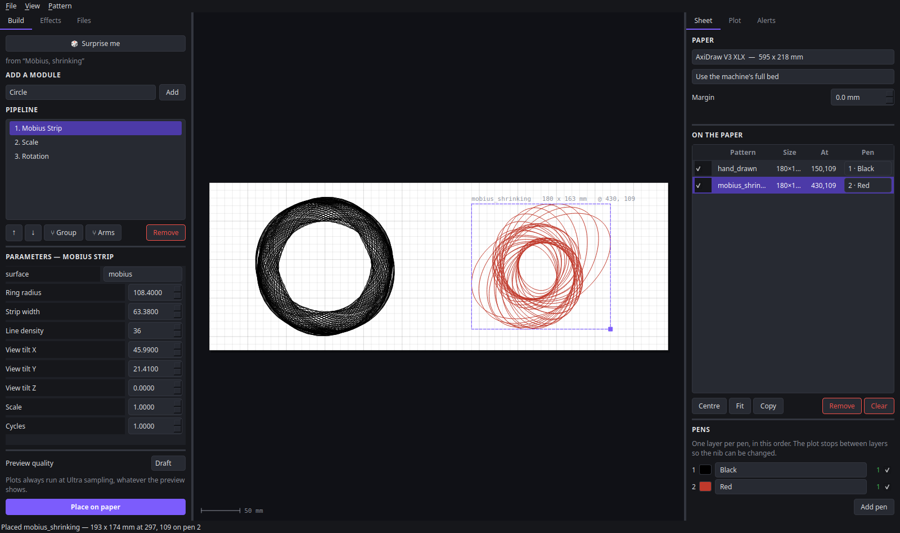
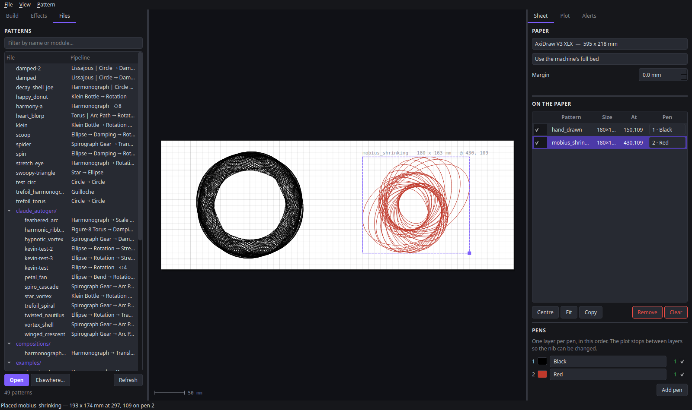
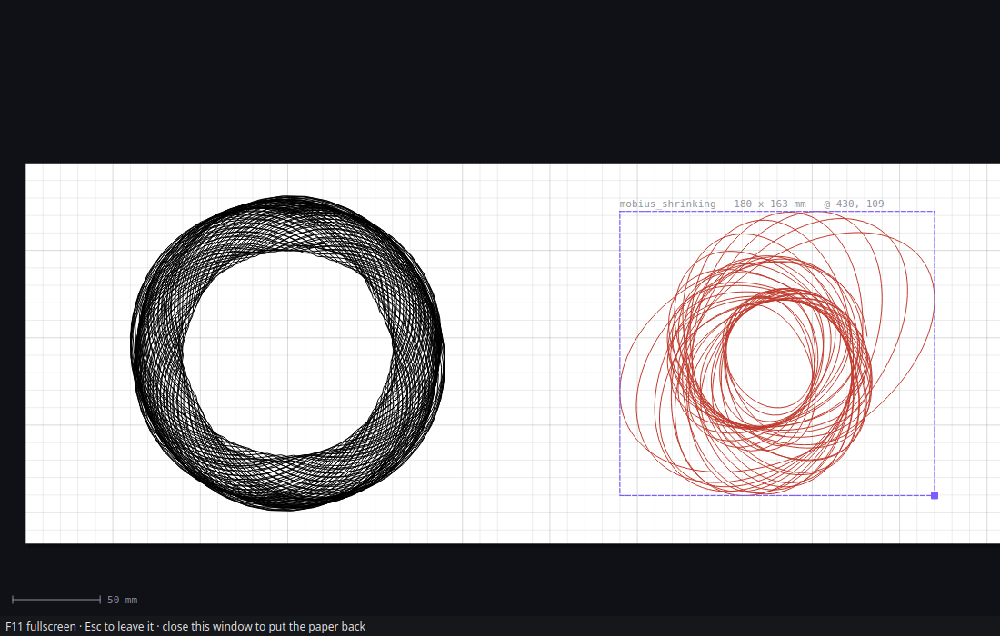

# Spirograph Generator

A modular system for creating complex mathematical art through composed transformations — a digital spirograph toy where you can stack effects, run parallel drawing arms, and smoothly drift parameters to create patterns impossible with physical tools.


*Harmonograph + circle + translation running as simultaneous parallel arms, with rotation and parameter drift*

## The app

```bash
./run_gui.sh              # open an empty pattern
./run_gui.sh some.ini     # open a pattern file
```

(`./launch.sh` still works and hands over to the same thing.)

Three columns: **build** the pattern on the left, arrange it on the **paper**
in the middle, drive the **machine** on the right.



The middle column is a real sheet. It is drawn at a known number of pixels per
millimetre, and every pattern on it is drawn through the same transform that
writes the SVG the plotter gets — so a pattern 90 mm wide sitting 120 mm from
the left edge is drawn 90 mm wide, 120 mm from the left edge, and *plots there*.
Drag moves it by the millimetres the pointer crossed. Arrow keys nudge by one,
shift by a tenth. A scale bar at the bottom says what the zoom means. Anything
that reaches past the drawable area turns red and says so before you plot it.

On first run the script builds `.venv/` and installs PySide6, NumPy and the
[AxiDraw API](https://cdn.evilmadscientist.com/dl/ad/public/AxiDraw_API.zip);
without the last one the app still runs and the plotter controls say why not.

### What it does

**Build** — a palette of every generator and transform, chained into a
pipeline. Drop a module into a *group* to run arms in parallel. Any parameter
with an `end_*` twin gets a drift control that interpolates it over the draw.
Draft / Fine / Ultra sampling for the preview; plots always run at Ultra.

**Surprise me** (`Ctrl+R`) builds a pipeline from one of sixty-one recipes —
ratios that close, decay rates that spiral rather than collapse, gear pairs
whose common divisor leaves lobes instead of a smear — with a range around each
number wide enough to keep surprising you. It says which recipe it used, and it
does not repeat itself until it has been through most of them.

**Effects** — symmetry (n-fold, with or without a mirror), pen lift (periodic,
threshold or angular), and moiré, which runs the whole pipeline several times
with one parameter nudged so the copies interfere.

**Files** — every `.ini` in the project with its pipeline beside it, filtered
as you type, one click to load.



**Sheet** — pick an AxiDraw model or a paper size, set a margin, and place as
many patterns as you like. Each one carries a **pen**; the pen list says what
that pen number means in ink and in name. *Clear* takes everything off the
sheet and leaves the pattern, the pens and the paper as they are.

**Plot** — speeds, pen positions, path reordering, manual jogging. *Estimate*
motion-plans every layer without opening the serial port. *Dry run* rehearses
the whole job with the pen up. *Plot* draws it, one layer per pen, stopping
between them to ask for the next nib — and remembering which layers are already
on the paper, so a stopped plot resumes rather than drawing them twice.

**Alerts** — Home Assistant, MQTT or a webhook, told when each layer finishes
and which pen goes in next, so the wait happens somewhere other than beside the
machine.

### Room for the paper

A sheet 600 mm across does not want to share a window with two panels.

* **`F11`** hides the side panels and gives the sheet the whole window.
* **`Ctrl+Shift+P`** puts the paper in a window of its own — drag it to a
  second monitor, `F11` there for fullscreen, close it to bring it back. It is
  the same canvas widget, reparented, never a copy: two canvases would be two
  opinions about where a pattern is, which is the bug this program was
  rewritten to stop having.



## How it is put together

```
spiro/pipeline/    the mathematics: the module table, INI <-> a pipeline
                   spec, the engine that runs one, and the randomizer's
                   recipes. No Qt, no plotter.
spiro/scene/       the sheet, in millimetres: paper, a placed item's box and
                   the one transform that places it, pens, and the SVG.
spiro/ui/          the window: canvas, panels, and the two worker threads.
axiplot/           the pen plotter, standalone — the in-process AxiDraw
                   driver, the layer loop, path optimisation, notifications.
                   Vendored from busy-python; see axiplot/VENDOR.md.
*.py at the root   the generators themselves (arc, harmonograph, rose, ...).
```

One millimetre is one unit throughout, and one user unit in the SVG that
reaches the machine. There are no percentages of a widget anywhere in it.

```bash
./run_tests.sh            # every gate: 324 checks, no hardware, no network
./run_tests.sh scene      # just one
```

## Command Line

```bash
# Generate from an INI file
python main.py examples/spirograph_gear_simple.ini

# PNG output (requires cairosvg)
python main.py examples/harmonograph_simple.ini --png output.png

# Generate all examples
./generate_all.sh --output-dir ./output
```

## How It Works

### Pipeline Composition

Every pattern is a pipeline of modules. Generators create shapes, transforms modify them, and the output of each feeds into the next:

```ini
[pipeline]
modules = spirograph_gear, rotation, arc
```

*"Generate a spirograph, rotate it while drawing, slide it along an arc."*

### Parallel Arms (Groups)

Modules separated by `|` in a group run simultaneously from the origin and their outputs sum — like independent drawing arms on a mechanical machine:

```ini
[arm]
type = group
modules = harmonograph | circle | translation
```

Each branch can itself be a serial chain:

```ini
[arm]
type = group
modules = gear1, slow_rotation | gear2, fast_rotation
```

### Parameter Drift

Any parameter with an `end_*` variant smoothly interpolates over the draw. Instead of discrete copies, the value changes continuously as the pen moves:

```ini
[gear]
type = spirograph_gear
hole_position = 0.3
end_hole_position = 0.9    # drifts from 0.3 → 0.9 over the draw
tooth_pitch = 1.0
end_tooth_pitch = 2.5      # drifts from 1.0 → 2.5 over the draw
```

## Generators

| Module | Description |
|--------|-------------|
| `spirograph_gear` | Classic two-gear spirograph (hypotrochoid/epitrochoid) |
| `harmonograph` | Pendulum simulator — 2–4 pendulums with decay |
| `lissajous` | Frequency-ratio curves (figure-8s, pretzels) |
| `rose` | Rhodonea petal patterns: r = cos(k·θ) |
| `circle` | Simple circle with radius drift |
| `polygon` | Regular polygons (triangle, hex, etc.) |
| `star_shape` | Pointed stars with inner/outer radii |
| `spiral_shape` | Archimedean spirals |
| `ellipse` | Oval with independent X/Y radii |
| `surface` | 3D parametric surfaces (torus, Möbius, Klein bottle, etc.) |
| `line` | Straight lines with timing control |
| `rack` | Gear rolling around stadium-shaped track |
| `spirograph_rail` | Gear rolling along a linear rail |

## Transforms

| Module | Description |
|--------|-------------|
| `rotation` | Spin the pattern around a point as it draws |
| `scale` | Grow or shrink over time |
| `translation` | Slide along a straight line |
| `arc` | Slide along a circular arc |
| `spiral_arc` | Slide along a spiral path |
| `bend` | Warp flat geometry into a curve (X→angle, Y→radius) |
| `damping` | Exponential decay envelope — pattern spirals toward a point |
| `noise` | Smooth random perturbation (hand-drawn look) |

## Configuration

```ini
[output]
width = 800
height = 800
stroke_width = 0.3
stroke_color = #000000
background_color = #ffffff
margin = 0.08

[sampling]
initial_samples = 100000   # Dense samples for accuracy
output_samples = 10000     # Final point count after arc-length resampling
use_arc_length = true
```

See `complete.ini` for documentation of every parameter.

## Requirements

- Python 3.8+
- NumPy
- PySide6 (for the app; `run_gui.sh` installs it)
- The [AxiDraw API](https://cdn.evilmadscientist.com/dl/ad/public/AxiDraw_API.zip)
  for plotting; without it everything but the machine works
- Optional: `cairosvg` for PNG export from the command line

## License

MIT
